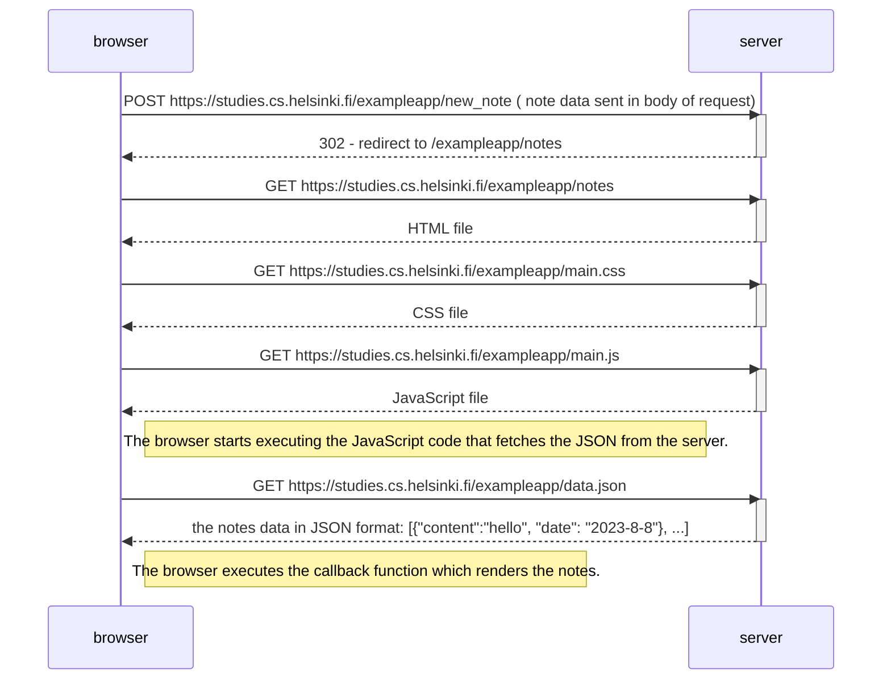

```mermaid

sequenceDiagram
participant browser
participant server

browser->>server: POST https://studies.cs.helsinki.fi/exampleapp/new_note ( note data sent in body of request)
    activate server
    server-->>browser: 302 - redirect to /exampleapp/notes
    deactivate server

    browser->>server: GET https://studies.cs.helsinki.fi/exampleapp/notes
    activate server
    server-->>browser: HTML file
    deactivate server

    browser->>server: GET https://studies.cs.helsinki.fi/exampleapp/main.css
    activate server
    server-->>browser: CSS file
    deactivate server

    browser->>server: GET https://studies.cs.helsinki.fi/exampleapp/main.js
    activate server
    server-->>browser: JavaScript file
    deactivate server

    Note right of browser: The browser starts executing the JavaScript code that fetches the JSON from the server.

    browser->>server: GET https://studies.cs.helsinki.fi/exampleapp/data.json
    activate server
    server-->>browser: the notes data in JSON format: [{"content":"hello", "date": "2023-8-8"}, ...]
    deactivate server

    Note right of browser: The browser executes the callback function which renders the notes.

```
