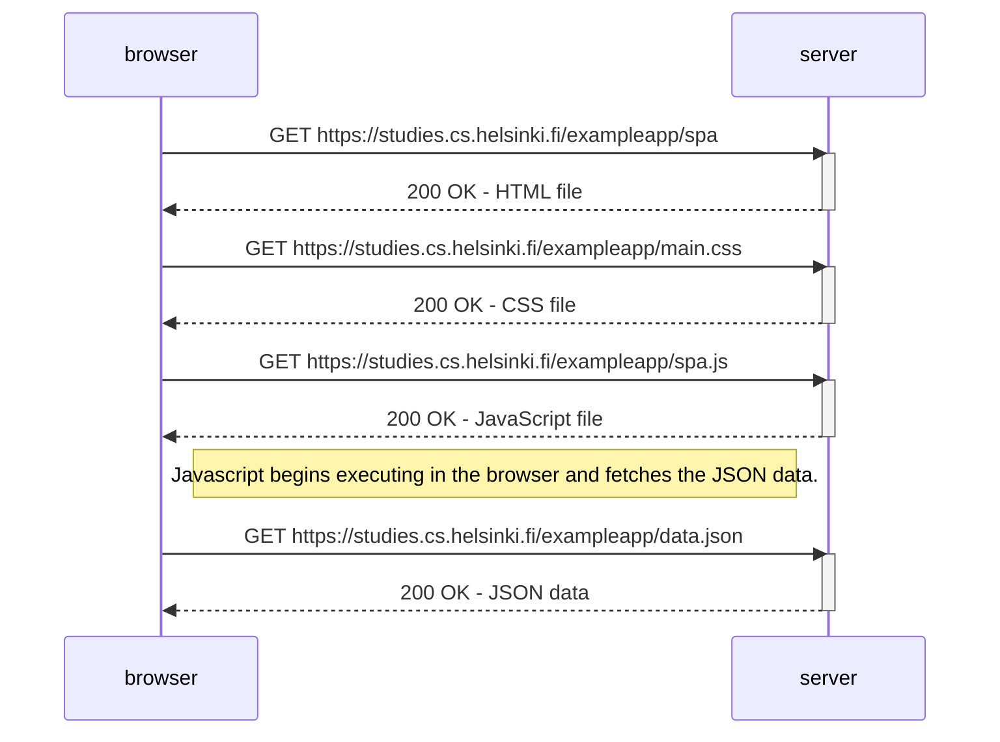

# 0.5. load the SPA

```mermaid

sequenceDiagram

participant browser
participant server

browser->>server: GET https://studies.cs.helsinki.fi/exampleapp/spa
activate server
server-->>browser: 200 OK - HTML file
deactivate server

browser->>server: GET https://studies.cs.helsinki.fi/exampleapp/main.css
activate server
server-->>browser: 200 OK - CSS file
deactivate server

browser->>server: GET https://studies.cs.helsinki.fi/exampleapp/spa.js
activate server
server-->>browser: 200 OK - JavaScript file
deactivate server

Note right of browser: Javascript begins executing in the browser and fetches the JSON data.

browser->>server: GET https://studies.cs.helsinki.fi/exampleapp/data.json
activate server
server-->>browser: 200 OK - JSON data
deactivate server

```
