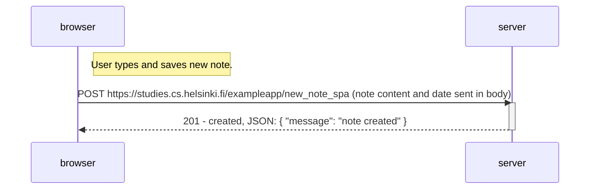

# 0.6. new note on a SPA

```mermaid

sequenceDiagram

participant browser
participant server

Note right of browser: User types and saves new note.

browser->>server: POST https://studies.cs.helsinki.fi/exampleapp/new_note_spa (note content and date sent in body)
    activate server
    server-->>browser: 201 - created, JSON: { "message": "note created" }
    deactivate server


```
